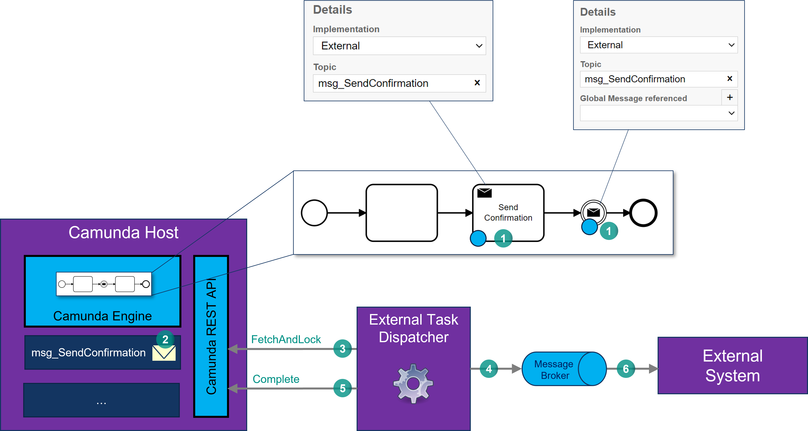

# Camunda External Task dispatcher

.NET implementation of a handler for External Tasks in a Camunda workflow.

## Hosting

This External Task Dispatcher is supposed to be used together with a centrally hosted Camunda engine that is reused for multiple business processes and multiple services. All communication with Camunda is done through its extensive [RESTful Web API](https://docs.camunda.org/manual/latest/reference/rest/):

The external services and systems will not communicate directly with the Camunda API. The operations of the Camunda API that need to be available will be abstracted by an API Gateway (AZ-IAG or OP-IAG).  

## Service tasks

**Service tasks** in Camunda are implemented using the **External Task** mechanism. The external task mechanism works as follows:

1. When in a process instance the execution token reaches a Service Task that is implemented as an External Task, Camunda will create a task in the topic with the name specified with that external-task (in the example `svc_GetCustomerDetails`). After that, the process-instance waits for the the task to complete.
1. The ETD periodically polls for available external tasks using the Camunda REST API. When it finds one, it fetches and locks the task using the Camunda REST API. The *lock* part means that this particular task is now being handled by the ETD and will not be visible to any other ETD instances. The external-task information contains a unique task-id and all the process-variables that are present in the process-instance.
1. Based on the topic-name in the task, the ETD can determine the API operation to call on the API Gateway. It uses the process-variables retrieved with the task to build a request (this is done by an external-task specific mapper) and executes the request.
1. The ETD takes the response from the API call and creates Camunda process-variables from the data in the response (this is done by an external-task specific mapper).
1. The ETD completes the external-task by calling the complete operation on the Camunda API and passing in the unique task Id and the Camunda variables.
1. The process-instance continues with the execution.  

## Send Message tasks & Message Throw events

**Send Message tasks** and **Message Throw events** in Camunda follow the exact same external-task mechanism as for Service tasks described above. Only the handling of the external-task by the ETD is different:

1. When in a process instance the execution token reaches a Send Message task or Message Throw event that is implemented as an External Task, Camunda will create a task in the topic with the name specified with that external-task (in the example `msg_SendConfirmation`). After that, the process-instance waits for the the task to complete.
1. The ETD periodically polls for available external tasks using the Camunda REST API. When it finds one, it fetches and locks the task using the Camunda REST API. The *lock* part means that this particular task is now being handled by the ETD and will not be visible to any other ETD instances. The external-task information contains a unique task-id and all the process-variables that are present in the process-instance.
1. Based on the topic-name in the task, the ETD can determine the message-broker topic to send a message to. It uses the process-variables retrieved with the task to build a message payload (this is done by an external-task specific mapper) and sends the message to the message-broker topic.
1. The ETD completes the external-task by calling the complete operation on the Camunda API and passing in the unique task Id.
1. The process-instance continues with the execution.  

## Receive Message tasks & Message Catch events

**Receive Message tasks** and **Message Catch events** are triggered using the Camunda REST API. The Message resource on the API offers a Correlate operation for this. In the payload of this operation you can specify a Process-definition ID and/or a Process-instance ID and/or multiple correlation keys to correlate a process-instance (see the [documentation](https://docs.camunda.org/manual/latest/reference/rest/message/post-message/)).

The ETD will subscribe to messages from a message-broker and use the Correlate operation for sending the message to Camunda:

1. When in a process instance the execution token reaches a Receive Message task or Message Catch event, the process-instance waits for the the task to complete. It will wait for a message with a specific name (in the example `msg_OrderReceived`).
1. An external system will send a message to the message-broker containing the name of the message and the process-instance Id (or some other form of correlation (see the [documentation](https://docs.camunda.org/manual/latest/reference/rest/message/post-message/))).
1. The ETD subscribes to the message-broker and waits for available messages. When it receives one, it creates Camunda process-variables from the data in the message (this is done by a message specific mapper).
1. Using the correlation information in the message, the ETD sends the message to the message-broker topic using the `correlate` method (see the [documentation](https://docs.camunda.org/manual/latest/reference/rest/message/post-message/)).
1. The process-instance continues with the execution.  

## User tasks

This is work in progress!

